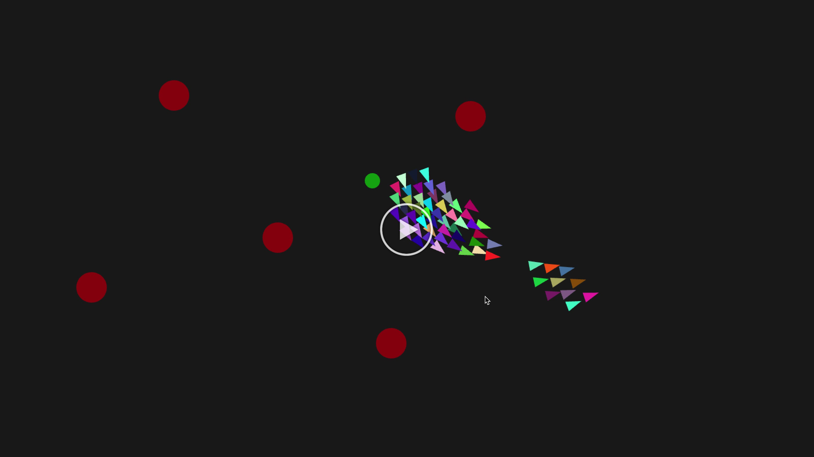
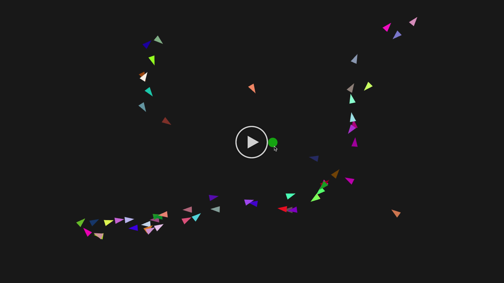

# Overview #

A simple Boid simulation, based on Craig Reynolds [seminal paper](http://www.cs.toronto.edu/~dt/siggraph97-course/cwr87/).

The intent of this project was to scratch a long-time itch, and (re)learn a few things along the way (although, the number of times I found myself on "GCSE Physics" and "Fun with Maths!" sites was somewhat depressing). For simplicity, Python and [Pyglet](https://bitbucket.org/pyglet/pyglet/wiki/Home) were used; Numpy was *not* used deliberately (as where would be the fun in that). This is certainly not supposed to be "production quality".

## Boid Behaviour ##

A boid's motion is a function of multiple, simple behavioural rules. Each rule uses information of _that_ boid's perceived local environment, meaning that each boid acts independently.

> "The aggregate motion of the simulated flock is the result of the dense interaction of the relatively simple behaviors of the individual simulated birds" -- Craig Reynolds

### Cohesion ###

Each boid attempts to move itself towards the [geometric center](https://en.wikipedia.org/wiki/Centroid) of all nearby boids. In this simulation, "nearby" is defined as being within a specified distance and angle, relative to a boids position and direction respectively. The cohesion change vector is simply `boid_position -> mean_position(nearby_boids)`.

### Alignment ###

Alignment attempts to change a boid's velocity (i.e., direction and magnitude) to match that of its nearby boids (using the same definition of "nearby"
as before). The below animation shows a world free from the shackles of alignment:

Cohesion drives each boid towards its nearest neighbours, but there's a couple of notable problems:

- boids moving in substantially different directions tend to perform dramatic fly-bys, rather than "flocking" together:
  the cohesive force in the above example isn't enough to slow boids moving in opposing directions. Once the boids pass
  each other, they no longer "see" each other, so the turning stops.
- given that a boids visible range extends mostly in its direction of travel, the cohesive forces generated will
  predominantly increase its speed. From the above example, after a short time, all boids reach maximum speed, and can no
  longer close the gap between it and its neighbouring boids (which are typically ahead of it). This results in more of
  a marching line than a flock.

The animation below shows a simulation with *only* alignment; it's more of a depressing death-march than a flock.

### Collision Avoidance ###

Most intelligent creatures (with the exception of my 5 month-old puppy) try their best to avoid running into things. It hurts. In this simulation, a symetric force is applied to boids that are in close proximity to each other. Note, the definition of proximity for collision avoidance only considers distance (i.e., it ignores the visibility). The avoidance force differs between available implementations; here, the force applied is the inverse square of the distance between boids.

Hitting `O` during the simulation will place a static obstacle at the current mouse position. The force repelling boids
from those static objects is stronger than the force between boids, but the calculation is essentially the same.

### Object Attraction ###

Global "attractors" can be introduced into the world by pressing `A`. Boids are attracted to all attractions, regardless
of distance and direction. Although I tried a few different functions to generate the attractive force, a simple
(`boid_position -> attractor_position`) was the most aesthetically pleasing.

### Combining Forces ###

In the original Boids paper, the "Arbitrating Independent Behaviors" section considers several strategies for combining
behaviours. In its current form, this project simply takes the sum of all change vectors. Future versions may explore
prioritization or more complex selection/blending.

# Setup #

This project was built against python3 -- as somewhat of an outsider, the 2 vs. 3 discussion appears to be a mess of biblical proportions.

`make init` will fetch the required packages. `make run` will run the simulation. Simples.

# Controls #

- `Q`: Quit
- `A`: Add Attractor (at the current mouse position)
- `O`: Add Obstacle (at the current mouse position)
- `+`: Add Boid
- `-`: Remove Boid
- `D`: Show debug (incl. each boid's direction and visible range)
- `V`: Show change vectors (displays a line for each behavioural rule's contribution)
